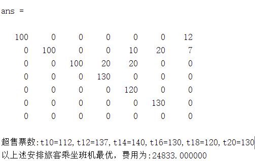

# 利用MATLAB整数规划解决一个简单机票超售最优化赔付问题

## 问题

A航空公司每天有6班航班从上海到北京，从上午10点到晚上8点，每两小时发一班航班。某天获知，前三班机每班可以容纳100名旅客，后三班机每班可以容纳150名旅客。如果某次航班超售，A航空公司可以把某预定了该次航班的旅客转到晚一点的航班，并且针对该延误两小时以上（含两小时）的旅客赔偿200元，每再多一小时，多赔偿20元。A航空公司总是可以把延期到晚上8点以后的旅客安排到另外的航空公司的11点航班上，最后安排的航班总有足够的位置. 假设某天，A航空公司卖了

$$ T_{10},T_{12},T_{14},T_{16},T_{18},T_{20} $$

张机票, 分别对应10点，12点，14点，16点，18点和20点的航班.

求解：从上海到北京的经济上的最优人员安排方案。

## 求解效果

